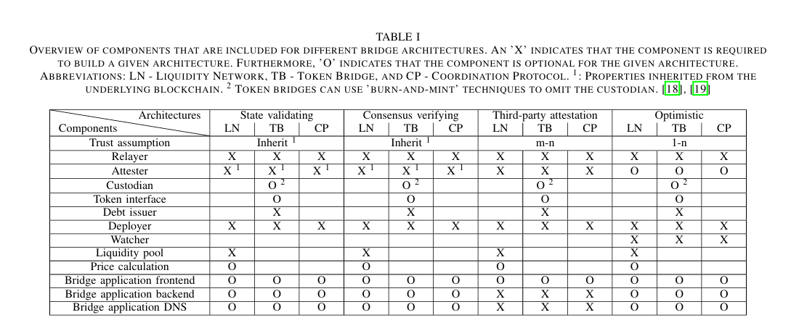

# protocollo/estensione GARGANTUA

proverò a creare il mio protocollo layer2/estensione

passi

1. capire i concetti di layer 2 e layer 1
2. su che blockchain costruirlo
3. che tipo di layer
4. a cosa servirà

The blockchain trilemma is a problem facing the digital ledger which states that the blockchain cannot achieve decentralization, security, and scalability simultaneously.
and this is a big issue if we want to gain adoption

**layer0**: i protocolli di layer0 sono le reti/l'infrastruttura su cui si costruiscono i layer1
il layer0 può risolvere diversi problemi tra cui il problema dell **Interoperabilità** essendo che se due blockchain si volessero scambiare dati/ comunicare tra di loro si dovrebbe far uso di un **bridge**.
Ma grazie al layer0 le blockchain vengono costruite sulla stessa rete togliendo il problema dei bridge.
Un altro problema che si può risolvere con i layer0 è la **scalabilità** in cui le funzioni crititche possono essere delegate ad altre blockchain evitando rallentamenti sulla rete o colli di bottiglia
vari tipi di layer0 sono:  
[Polkadot](https://assets.polkadot.network/Polkadot-whitepaper.pdf) in cui ogni blockchain viene chiamata **parachain** e una catena principale chiamata
**Relay Chain** che permette la comunicazione tra le parachain.  
[Cosmos](https://gateway.pinata.cloud/ipfs/QmWXkzM74FCiERdZ1WrU33cqdStUK9dz1A8oEvYcnBAHeo) in cui è composta da una rete principale chiamata **cosmos hub** e da
blockchain personalizzate chiamate **zone**

**Layer1**: sono blockchain che possono validare e eseguire le transazioni senza la necessità di un atra rete
queste reti non hanno bisogno di una third party per le transaizoni, possono avvenire quando si ha voglia, mostrano tutte le transazioni senza rilevare chi le ha fatte
si possono costruire applicazioni su alcuni di esse (ETH), una volta eseguite le transazioni non sono riversibili, insomma possono fare tante cosa dalla privacy/sicurezza, a movimentazione
di soldi, a creazioni di applicazioni ecc. ma hanno uno svantaggio che sarebbe la **scalabilità** il **costo**, **token per eseguire le transazioni**.
queste problematiche non avvengono tutte e tre su ogni layer1 per esempio su bitcoin è difficile creare applicazioni o usare altri token essendo che accetta solo BTC
su eth il costo delle transazioni è alto e più si usa la rete e più le ffes (gas) diventano alte.  
**Layer2**: vengono utilizzate per alleggerire il crico dei layer1, arrivano in soccorso ai layer2 per sistemare il problema **blockchain trilemma**.  
**zkSync** zkSync usa la tecnologia dei Zero-Knowledge Rollup, che offre alta sicurezza grazie alla prova crittografica delle transazioni senza dover rivelare i dettagli delle stesse

| Layer2     | Techology                                 | avarage TX fee         |
| ---------- | ----------------------------------------- | ---------------------- |
| base       | Optimistic Rollup using OP Stack          | $0.002 USD to Send ETH |
| Arbitrum   | Optimistic Rollup & AnyTrust Chain        | $0.01 USD to Send ETH  |
| Optimistic | Optimistic Rollup & Modular OP Stack      | $0.03 USD to Send ETH  |
| Stacks     | Hybrid Bitcoin L2 with Nakamoto Consensus | $0.20 USD to Send BTC  |

**Layer3**: applicazioni che si basano sulla blockchain. Giochi, Wallet, NFT, dex, inoltre possono migliorare anche loro la scalabilita rendendola **iper-scalabilità**  
**XAI** costruita su arbitrum che permette di facilitare l'adozione di giochi sulla blockchain.  
Per i Giocatori offre un'esperienza di gioco senza interruzioni dove non devono preoccuparsi di gestire crypto wallet o pagare per le transazioni all'interno del gioco.
Per l'Ecosistema facilita la creazione di una rete di giochi interconnessi dove asset, giocatori, e comunità possono interagire in modo più fluido.

Alla fine le banche vengono scelte perchè te gli consegni i soldi firmi quattro fogli che non si sa cosa siano e hai finito, inoltre sono molte più intuitive rispetto
alla blockchain che bisogna creare un wallet, non dire a nessuno la seed phrase, se la perdi ciao ciao i tuoi soldi, per prelevare servono 4 numeri, anche se tra quattro
numeri e un address per fare una transazione non cambia molto, che dopo con i nostri soldi fanno quello che vogliono e se succede una corsa ai sportelli ci domandiamo cosa cazzo è successo è un altro conto, un altro motivo per
il quale si sceglie ancora le banche è che la blockchain viene associata a scamm ma questo è per colpa **dell'ignoranza finanziaria**. Se io scrivessi su instagram
investi in questo token e guadagerai 1000$ al giorno **nessuno va a vedere cosa fa quel token o le funzionalità del protocollo o il fondatore di quel token** ma
questo non è un problema della blockchain ma **dell'istruzione**, siamo nel 2024 e come è possibile che nelle scuole non venga insegnato economia o finanzia.
un altro problema sono i governi che sono ostili che non accettano l'innovazione. goveni abbastanza totalitari come cina, **USA** si usa con l'amministrazione biden,
europa in cui decidono loro cosa pensano sia il bene del popolo ma in verita fanno solo il bene delle lobby non vorranno un sistema di pagamento o una tecnologia che
non ha un punto centrale ma è decentralizzata e quindi cercheranno di rovinarla. mining in cina bandito, in america la sec che rompe le palle a tutte le aziende
che fanno protocollo es. XRP, COINBASE, KRAKEN, europa con il mipa uscito da poco, in italia volevano fare tassa sulle cryptovalute al 46%, bisognerebbe avere gente
non che sia giovane o vecchio o marrone ma che sia capace come **Bukele** che utilizza energia geotermica per il mining, attirando aziende e capitali cosi che sia il
governo e le aziende ci guadagnano.

Questi sono i problemi principali e per risolveri bisognerebbe cambiare l'istruzione alla fine non c'erano cosi tanti corsi prima dell'avento dell'AI e ora compaiono
come funghi.
L'altro punto per migliorare la reputazione e l'adozione della blockchain sarebbe quella di migliorare l'interfaccia/interazione e questo possono venire in soccorso i
layer3

# Il ruolo dei layer nella blockchain

I layer 0 probabilmente non avranno un impatto significativo rispetto ai layer 1 e ai layer 2. I layer 3, invece, saranno più utilizzati poiché saranno
loro ad attirare le persone con l’implementazione di giochi, dApp, NFT e altre funzionalità.
Il vantaggio principale dei layer 0 è quello di consentire la comunicazione tra blockchain diverse o migliorare la scalabilità. Tuttavia, queste
funzioni possono essere sostituite dai layer 2, rendendo i layer 0 meno centrali.
I layer 3 sono sicuro che giocheranno un ruolo importante non solo per quanto riguarda le funzionalità, ma anche per fornire un’interazione più intuitiva tra blockchain e persone.

## Problemi di adozione della blockchain

Uno dei motivi per cui le banche continuano a essere preferite è la loro intuitività. Consegni i soldi, firmi quattro fogli e hai finito.
Al contrario, con la blockchain bisogna creare un wallet, custodire la seed phrase (che se persa rende i fondi irrecuperabili) e utilizzare indirizzi lunghi per le transazioni. Anche se tecnicamente non c’è molta differenza tra
inserire un PIN e un address, la percezione dell’utente medio è che la blockchain sia più complicata. Inoltre, molte persone associano la blockchain a truffe, ma questo è un problema legato **all’ignoranza finanziaria**.
Ad esempio, se qualcuno su Instagram promuove un token promettendo guadagni di 1000$ al giorno, nessuno si informa sul progetto, sul team o sulle funzionalità del protocollo e le persone ci investiranno soldi senza sapere in che cosa li stanno mettendo.
Questo non è un problema della blockchain, ma della mancanza di istruzione. Sembra assurdo che nel 2024 nelle scuole non si insegnino economia o finanza **ASSURDO**.
un altro problema che ha ora la blockchain è la **balkanization**. ogni blockchain operano come se fossero all'interno di un silos senza interagire tra di loro. Questa si vede attraverso il modello di consenso(PoW, PoS), lo schema di transazioni (in bitcoin vengono salvate le transazioni e gli UTXO Unspent Transaction Output invece in eth viene salvato lo stato dell'account), e le funzionalità dei smart contract

## Ostilità dei governi

Un altro ostacolo è rappresentato dai **governi**, che spesso si dimostrano ostili verso l’innovazione. Paesi con approcci autoritari o protezionistici, come la Cina (che ha bandito il mining) o gli Stati Uniti, si proprio gli **USA**
(con l’amministrazione Biden e le azioni della SEC contro aziende come XRP, Coinbase, Kraken), frenano l’adozione. Anche l’Europa con regolamenti come MiCA e politiche fiscali aggressive (ad esempio, la proposta in Italia di tassare le criptovalute al 46%) scoraggia l’innovazione.
Questi governi pensano che stiano proteggendo le persone ma in verità fanno solo il bene delle **lobby con poche aziende e monopoli**, piuttosto che favorire il progresso tecnologico decentralizzato. Al contrario, esempi come quello di Nayib Bukele in El Salvador, che utilizza energia
geotermica per il mining e attrae capitali e aziende, dimostrano come sia possibile trarre vantaggio dalla blockchain sia per il governo che per le imprese.  
Questo grafico mostra l'energia per il mining di bitcoin e si vede che comunque anche con il picco di bitcoin ai 99.000 l'energia non ha raggiunto il picco della bullrun quando è arrivato a 68.000, questo dimostra che i miner stanno cercando soluzioni più economiche per loro e anche emno dispendiose (i bitcoin rig immersi nel liquido o anche soluzioni come bukele)

Per risolvere i problemi, **sarebbe necessario delle riforme e cambiare mentalità**.  
è necessario cambiare l’istruzione. Prima dell’era dell’intelligenza artificiale, i corsi sull’AI erano quasi inesistenti, e oggi sono diffusissimi. Lo stesso dovrebbe accadere per la blockchain.
Un altro punto fondamentale è migliorare l’interfaccia e l’interazione con la blockchain. Questo è un ambito in cui i layer 3 possono dare un contributo importante, rendendo l’esperienza più intuitiva e accessibile agli utenti,
migliorando così reputazione e adozione, perchè ho visto molte persone intervistate che dicevano che era troppo complicato

Lascio a voi l'immagine di un grafico per farvi capire l'importanza e l'uso della blockchain

l'aumento delle transaizoni in ogni blocco

In cina anche se c'è il blocco il mercato delle applicazioni blockchain continua a crescere

ci sono due soluzioni che vorrei costruire di layer3.
la prima è quella di un gioco penso qualcosa con un avatar o qualcosa che riguarda gli NFT ma non ho ancora idea sopratutto quello ce riguarda
gli NFT essendo che ora non hanno ancora uno scopo definito ma sono più beni di stato (tipo gucci/suprime).
onestamente penso che i NFT avranno un futuro in futuro sopratutto quando il metaverso dventerà main nelle nostre vite, verranno
utilizzati si come biglietti a eventi, ma anche come esposizione tra fiere di arte o anche come passaporto tra aree nel metaverso,
avere gadgets gratis o certe features come balli (es come quelli in fortnite)
strumenti per la creazione, gestione e scambio di asset in-game, con supporto per NFTs.

La seconda soluzione è un protocollo per lo scambio di asset tra diverse blockchain, senza la necessità di un ente centralizzato, come avviene con i CEX (exchange centralizzati). L'idea è di migliorare significativamente l'esperienza utente, offrendo una soluzione che consenta il trasferimento e lo scambio diretto tra blockchain in modo semplice e sicuro.
Un estensione che scaricabile che ti permette di scambiare token direttamente dal sito su cui ti trovi simile a metamask
ma al posto di essere un hot wallet permetterà di scambiare token tra blockchain
Permettere il trasferimento diretto di asset tra diverse blockchain senza la necessità di intermediari centralizzati o bridge centralizzati che potrebbero
introdurre rischi di sicurezza.
Tecnologie come IBC (Inter-Blockchain Communication) di Cosmos o Cross-Chain Communication (CCC) sono fondamentali. Questi protocolli gestiscono la
comunicazione sicura tramite la crittografia e la verifica tra le blockchain, accesso tramite chiave privata come metamask,
scambio dei token in modo corretto e facile interazione per utente.  
In sostanza, questa non sarebbe un protocollo standalone, ma piuttosto un'estensione simile a MetaMask, progettata specificamente per facilitare lo scambio cross-chain.

All'inizio cercherò di implementare solo l'interazione tra la blockchain di Ethereum e quella di Bitcoin. Si potrà visualizzare il saldo del wallet su ciascuna di esse, firmare transazioni, bloccare token e creare token wrapper nell'altra chain. Per l'operazione di scambio tra le due blockchain utilizzerò cross-chain.
I token bloccati dovranno essere depositati in address controllati da entità che fanno staking. Se queste entità si comportano in modo scorretto utilizzando i token bloccati, si attiverà un meccanismo di slashing. Coloro che metteranno in staking i token guadagneranno tramite le fee, a cui si aggiungerà una somma extra rispetto a quella destinata ai miner.
Le persone che desiderano mettere in staking i token per fare da address ai token bloccati dovranno prima bloccare una quantità di denaro proporzionata al valore massimo che l'address potrà contenere. Ad esempio, se una persona blocca 200.000$, l'address assegnato potrà contenere al massimo 200.000$ di token bloccati. Inoltre, ogni address sarà legato a un unico tipo di token, così da evitare comportamenti scorretti da parte di chi gestisce i token bloccati.
Se i token bloccati sono pari o inferiori al valore dei token messi in staking, la persona che gestisce l'address non avrà incentivi a comportarsi in modo scorretto, poiché non ci sarebbe alcun guadagno. Tuttavia, se la persona si comporta in modo scorretto (ad esempio, non restituendo correttamente i fondi), il sistema applicherà lo slashing ai token in staking.
Se chi ha messo i propri soldi in staking decide di ritirarli e smettere di partecipare, dovrà attendere un periodo di tempo prestabilito. Durante questa finestra, gli utenti che hanno bloccato i loro soldi nell'address verranno avvisati e potranno ritirarli. Tuttavia, se non li ritirano entro il termine stabilito, rischiano di perdere i loro fondi ancora bloccati.

 
   

**(Per futuro )** L'idea è creare un protocollo basato su staking di più token (multi-token staking), in cui gli utenti possono depositare token diversi e ricevere ricompense esclusivamente attraverso le fee generate dal protocollo, senza l'emissione di nuovi token.

in cui X è il prezzo dei token e p è la loro quantità.   
In alternativa, si possono bloccare i token in un address, e i proprietari forniscono una prova che una certa quantità appartiene a loro.
Il problema principale è come garantire che la prova sia sicura senza rivelare le chiavi private?
La risposta sarebbe la **crittografia**.  
Un altro problema sarebbe la generazione dell'address. Se il protocollo crea un address unico, potrebbe conoscere la chiave privata, rischiando di compromettere la sicurezza..  
la risposta sarebbe nel **dividere la chiave privata**. Ogni partecipante detiene solo un frammento della chiave privata, che può essere utilizzato come prova della proprietà dei token bloccati.

ora come ora farò poco di codice e inizerò a leggere paiper

link architettura

https://arxiv.org/pdf/2403.00405  
https://ietresearch.onlinelibrary.wiley.com/doi/epdf/10.1049/blc2.12032  
https://www.sciencedirect.com/science/article/pii/S1389128622004121  
https://www.researchgate.net/publication/384828204_Blockchain_Cross-Chain_Bridge_Security_Challenges_Solutions_and_Future_Outlook

link bridge ren

https://republicprotocol.github.io/whitepaper/republic-whitepaper.pdf  
https://github.com/renproject/ren/wiki/

link wrapping

https://www.researchgate.net/publication/357344259_Wrapping_Trust_for_Interoperability_A_Preliminary_Study_of_Wrapped_Tokens 

link wanchain

https://docs.wanchain.org/introduction/old-placeholder/papers-and-downloads  
zero-knowledge technology

link THORchain

https://github.com/thorchain/Resources/blob/master/Whitepapers/THORChain-Cryptoeconomic-Paper-May2020.pdf

### SoK: Cross-Chain Bridging Architectural Design Flaws and Mitigations

Uno dei principali problemi evidenziati nel paper **SoK: Cross-Chain Bridging Architectural Design Flaws and Mitigations** è l'architettura ambigua dei bridge, che può portare a exploit significativi. Un punto critico è rappresentato dal custodian, dove sono stati rubati oltre un miliardo e mezzo di dollari.
Private key è la vulnerabilità principali, specialmente quando si approva il rilascio dei fondi da una pool o un custodian, minare i nuovi fondi
attraverso il debt issuer o bruciarli. Un altra vulnerabilità e con il deployer il quale si può cambiare per sbaglio il pointer di uno smart contract durante
l'aggiornamento

Quattro tipi di bridge:

1. Liquidity networks
   In questo modello, **il token viene depositato in una pool sulla chain principale**. In cambio, **si ottiene l'equivalente nella pool della chain secondaria**. Questo approccio consente di mantenere la liquidità tra le due blockchain senza necessità di scambi diretti.
2. Token bridges
   Qui, i token vengono bloccati sulla chain di origine e, sulla chain di destinazione, viene creato un token sintetico che rappresenta i token bloccati. Questo metodo è spesso utilizzato per garantire che il valore rimanga equivalente tra le due catene.
3. Coordination protocols
   Questi protocolli abilitano funzionalità complesse come la condivisione di dati e chiamate di funzione tra diverse blockchain. Sono fondamentali per applicazioni che richiedono interazioni più elaborate oltre il semplice trasferimento di token.
4. hub-parachain
   Questa architettura è presente in sistemi come Cosmos e Polkadot, in cui è presente un hub e tutte le parachain(polkadot) e zone(cosmos) comunicano con l'hub. questi hanno la stessa architettura e comunicano molto facilemnte.  
   se si volesse comunicare con blockchain che non hanno la stessa architettura allora bisogna affidarsi a moduli speciali

   

quattro tipi di protocolli cross-chain

1. State Validating Protocols (sidechain e relay)
2. Verifying Protocols (HTLCs)
3. Third-party Attestation Protocols(DPKC)
4. Optimistic Protocols

le mie opzioni sarebbero la 2 o la 4 essendo che la prima sarebbe meglio tra layer1 e layer2 secondo il paper invece la 3 la scarto a prescindere, invece per
il tipo di bridge sarebbe il token bridge.  
Nella 4 dovrei implementare la logica della finestra di tempo, il blocco dei token e il mint dei token sulla blockchain, il rilascio se la persona vuole riconvertire i suoi token e la verifica della transazione avvenuta su bitcoin da parte di eth.

Nella figura seguente mostra i componenti che si devono sviluppare e quelli che sono opzionali

- **Trust Assumption**: La blockchain fornisce un modello di fiducia che consente alle parti coinvolte di interagire senza necessità di un intermediario centrale.
- **Relayer**: Questa entità esegue chiamate per operazioni cross-chain, utilizzando protocolli come l'Inter-Blockchain Communication (IBC) per trasmettere informazioni tra diverse blockchain ma stessa architettura.
- **Custodian**: Funziona bloccando gli asset sulla blockchain prima della creazione di asset sintetici. Questo componente è particolarmente vulnerabile agli attacchi informatici.
- **Token Interface**: Consente la conversione degli asset in asset sintetici, comunemente noti come "wrapped assets".
- **Debt Issue**r: Responsabile della creazione di asset sintetici sulla blockchain di destinazione. Questa operazione avviene solo dopo che il custodian ha bloccato gli asset. Inoltre, il debt issuer gestisce anche il processo di "burn" degli asset sintetici quando si desidera riconvertirli.
- **Deployer**: Si occupa dell'aggiornamento dei contratti del bridge, garantendo che siano sempre allineati con le ultime esigenze e standard di sicurezza.
- **Watchers**: Questi componenti monitorano le attività fraudolente e sostituiscono gli attester nell'architettura degli Optimistic Protocols, contribuendo a mantenere l'integrità delle transazioni.

### CONCETTI PER IMPLEMENTAZIONE E AUMENTARE LA SICUREZZA

**Multi-Signature**: Per transazioni che coinvolgono grandi somme di denaro, è possibile implementare metodi di firma multi-firma, aumentando così la sicurezza delle operazioni.
**Finestra per i Watchers**: Estendere il tempo a disposizione dei watchers per rilevare transazioni fraudolente può contribuire a prevenire attività malevole.
**Meccanismo di Pausa**: Implementare un sistema che consenta di mettere in pausa le funzionalità del bridge in caso di vulnerabilità scoperte può proteggere gli asset durante situazioni critiche.

## OBBIETTIVI FINALI

- Facilitare trasferimenti da e verso qualsiasi rete.
- Offrire un'interfaccia semplice e automatizzata.
- Decentralizzare completamente il sistema, ponendo la responsabilità sugli utenti.
- Sviluppare un metodo che consenta il passaggio da una chain A a una chain C tramite una chain B (A → B → C e viceversa), mantenendo la stessa struttura e integrità delle informazioni.
- permettere di bloccare fiat e utilizzarla sugli exchange decentralizzati (se c'è gente che non vuole essere soggetta a fluttuazioni)
- permettere di scambiare due token tra due utenti (implementando l'atomic swap)